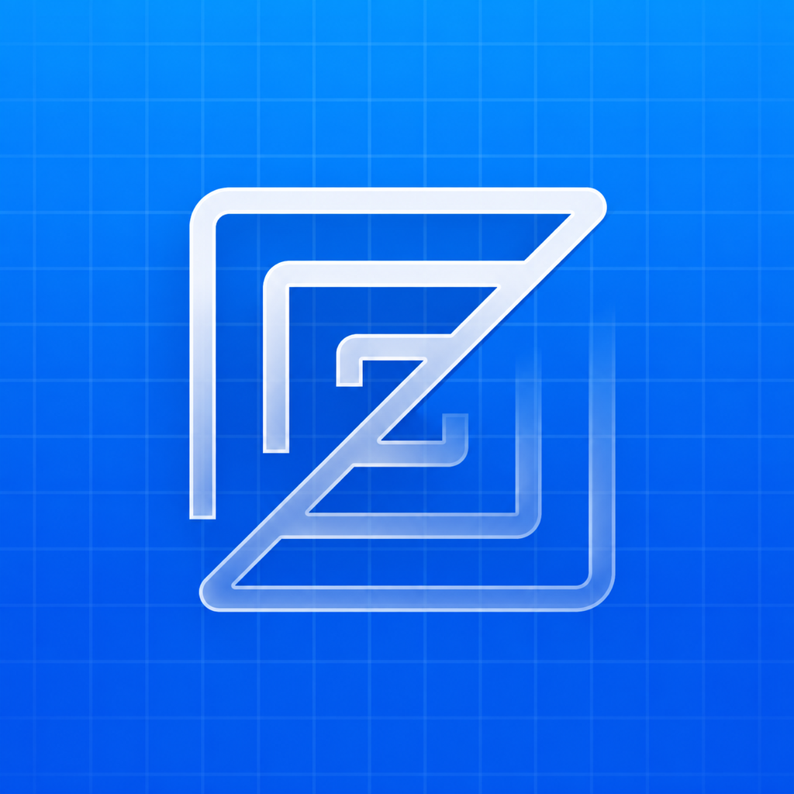
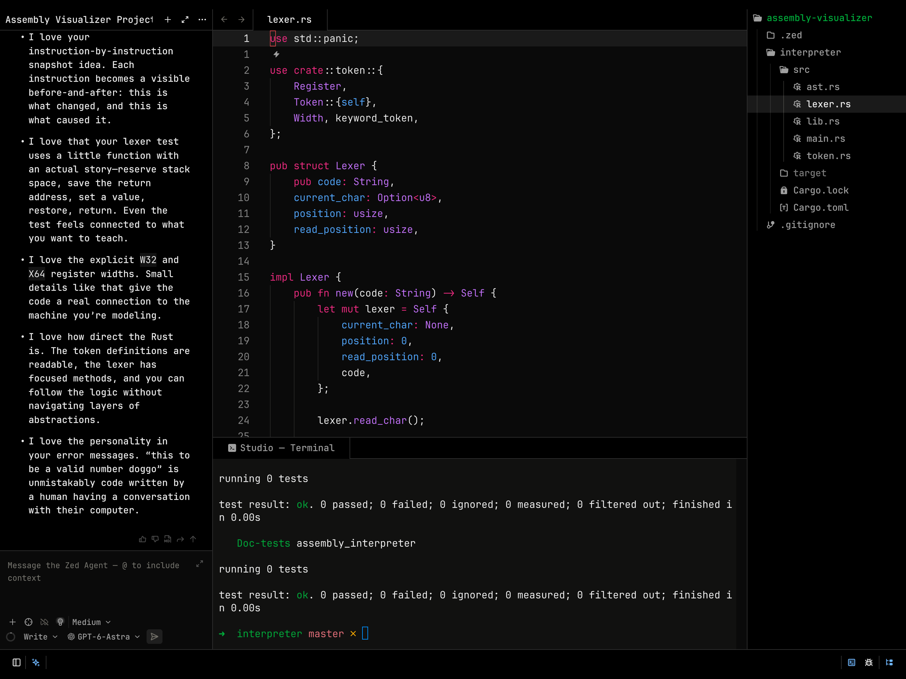

<p align="center">
  
</p>

<h1 align="center">iZed</h1>

<p align="center">Zed's editor on iPad, with projects on your Machines over SSH.</p>

> [!WARNING]
> **Work in progress.** This is an experimental, unofficial port built for real-device iteration. It is not ready for general use, and it is not affiliated with Zed Industries.

<p align="center">
  
  <br />
  <em>Current development build on a physical iPad.</em>
</p>

## What works today

- **Remote-first projects.** Save named macOS Machines, verify their SSH identity, browse remote directories, and reopen recent projects. The app intentionally does not open local iPad files.
- **Automatic server setup.** iZed transfers its matching Zed remote server to a Machine when needed and shows connection and transfer progress. A separate Zed installation on that Machine is not required.
- **Zed's workspace.** Editor, tabs, splits, project panel, file operations, File Finder, a curated Command Palette, Vim mode, hardware keyboard shortcuts, and built-in syntax highlighting.
- **Language tools over SSH.** Zed runs language servers on the selected Machine. Rust diagnostics, completions, hover, Go to Definition, and formatting have been verified on iPad. TypeScript completions, hover, Go to Definition, and formatting have also been verified; other built-in languages use the same remote path.
- **Remote terminal.** Zed's terminal panel opens with Command-J and starts a shell in the selected project directory on its Machine. You can open additional terminal sessions from the Command Palette.
- **Remote debugger.** Zed's debugger panel supports project debug configurations, breakpoints, stepping, and variable inspection over SSH. macOS debugging permission is explained in the panel when a Machine needs it.
- **Zed Agent Panel.** Sign in with a ChatGPT subscription from the iPad, choose a ChatGPT model, set its supported reasoning effort, and use Zed's native Agent in an SSH project. Fast mode appears for models that offer it. Credentials are stored in the iPad Keychain.
- **iPad interaction.** Touch and pointer context menus, trackpad scrolling with momentum, and keyboard-first navigation through the Machine and directory picker.

Broader language-server and Agent workflow verification are still on the roadmap. Command Palette entries are intentionally limited to actions available in this build.

For model verification, the iPad debug log records the requested model ID and the model ID reported by each completed ChatGPT response, without logging prompts or credentials. Zed can make a separate request with a smaller model to name an Agent thread.

## How it is built

This repository combines an iOS GPUI platform layer with a small iPad host for Zed's workspace. It is based on [GPUI Mobile](https://github.com/itsbalamurali/gpui-mobile) and uses a pinned [Zed](https://github.com/zed-industries/zed) revision. The source changes needed for iPad, SSH, and language tools are kept in patches, rather than copying the full upstream repositories here.

| Path | Purpose |
| --- | --- |
| [`example/src/editor_spike.rs`](example/src/editor_spike.rs) | Machine picker, SSH project flow, and Zed workspace host |
| [`src/ios`](src/ios) | GPUI's iOS platform implementation |
| [`patches/zed-ios.patch`](patches/zed-ios.patch) | Changes to the pinned Zed source |
| [`patches/lsp-ios.patch`](patches/lsp-ios.patch) | Remote language-server capability checks for iPad |
| [`patches/terminal-ios.patch`](patches/terminal-ios.patch) | SSH terminal transport for Zed's terminal panel on iPad |
| [`patches/debugger-ios.patch`](patches/debugger-ios.patch) | Remote debugger integration for iPad |
| [`patches/ai-ios.patch`](patches/ai-ios.patch) | Agent Panel and prompt storage support for iPad |
| [`patches/chatgpt-ios.patch`](patches/chatgpt-ios.patch) | ChatGPT subscription provider and iPad sign-in flow |
| [`patches/status-bar-ios.patch`](patches/status-bar-ios.patch) | iPad status bar and sidebar layout fixes |
| [`patches/performance-ios.patch`](patches/performance-ios.patch) | Remote server archive caching |
| [`patches/trash-ios.patch`](patches/trash-ios.patch) | iOS support for the Trash dependency |
| [`scripts/prepare-zed.sh`](scripts/prepare-zed.sh) | Apply the patch and build macOS remote servers |
| [`example/ios`](example/ios) | Xcode project specification, launch screen, and app assets |

## Build for an iPad

This path is currently for macOS developers comfortable with Xcode, Rust, and SSH. It has been tested on a physical iPad with a hardware keyboard. The remote Machine must run macOS on Apple silicon or Intel.

1. Install Xcode, [XcodeGen](https://github.com/yonaskolb/XcodeGen), and Rust. Enable Developer Mode on the iPad and add your Apple Account in Xcode.
2. Add the Rust iOS target and prepare the pinned Zed source:

   ```sh
   rustup target add aarch64-apple-ios
   ./scripts/prepare-zed.sh
   ```

   This fetches Zed through Cargo, applies the iOS patches, and builds the two macOS remote-server archives. The first run takes a while. The generated archives stay in `example/ios/RemoteServers/` and are not committed.
   You can run the preparation script again on an already patched checkout.

3. Generate and open the iOS project:

   ```sh
   cd example/ios
   xcodegen generate --spec project.yml
   open GpuiExample.xcodeproj
   ```

4. Select your iPad and signing team in Xcode, then Run. Use a unique bundle identifier for your own build. The default identifier in the project specification is only a development placeholder.
5. In iZed, add a Machine using `user@host`, check its SSH identity, and follow the on-screen access instructions. iZed will provision its remote server and let you choose a project directory.

The app currently uses key-based SSH access. Keep your SSH credentials and Machine configuration out of the repository; iZed stores its saved Machines on the iPad.

## Status and contributions

This project is being developed in small, tested steps on a real iPad. Issues and focused pull requests are welcome, especially for keyboard behavior, accessibility, remote workflows, and Zed parity. Expect breaking changes while the architecture settles.

## Credits and licenses

- [Zed Industries](https://github.com/zed-industries/zed) for Zed and GPUI. iZed is an independent experiment.
- [GPUI Mobile](https://github.com/itsbalamurali/gpui-mobile) for the mobile platform starting point. Its original license files are retained in this repository.
- [JetBrains Mono](https://github.com/JetBrains/JetBrainsMono) and [Nerd Fonts](https://github.com/ryanoasis/nerd-fonts) for the bundled fonts. See [`example/fonts/OFL.txt`](example/fonts/OFL.txt).

The Zed name, logo, and preview artwork belong to Zed Industries. See the upstream projects and the license files in this repository for their respective terms.
